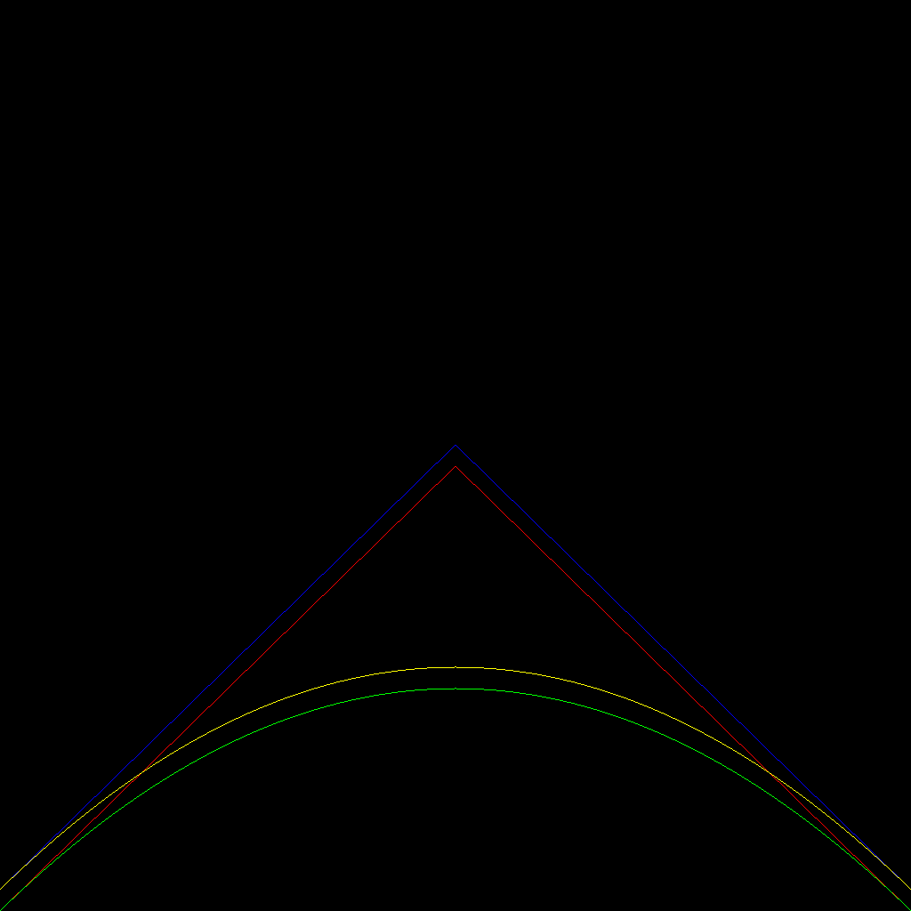
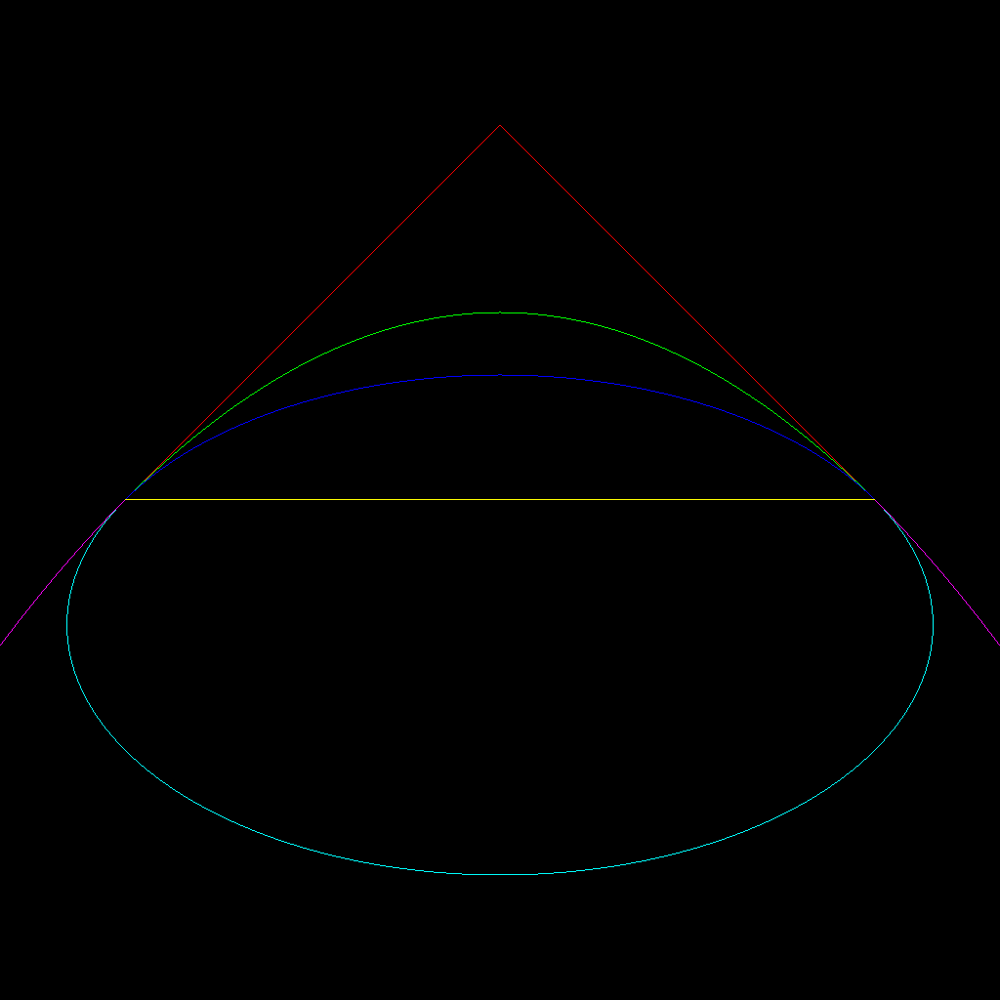
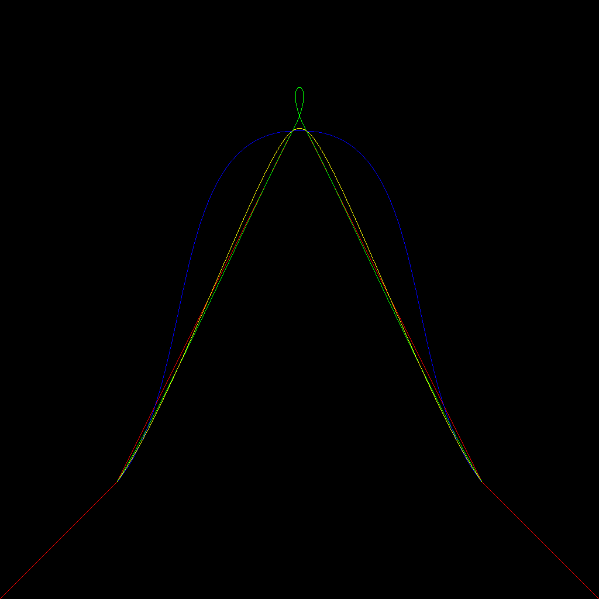

# コンピュータグラフィクス論 基本課題M1

## 対応環境

| プラットフォーム | 動作確認 | バイナリ配布 |
| - | - | - |
| Windows | 確認済み | `target\release\utokyo-FSC-IS4029L1-assignment-m1.exe` |
| macOS | 未確認 | 無し |

## ディレクトリ構造

| ディレクトリ名 | 説明 |
| - | - |
| [`src`](src) | ソースコード |
| [`target`](target) | 実行ファイル |
| [`examples`](examples) | 動作例 |

## ビルド方法 

+ [Rust](https://www.rust-lang.org/ja)をインストールする。
+ `cargo build --release`を実行する。

また、`cargo run --release --`で直接実行できる。

## 動作説明

### コマンドライン引数

`--help`で説明を表示できる。
[`args.rs`](src/args.rs)に該当部分のコードがある。

#### 説明を表示する

```sh
cargo run --release -- --help
```

#### 入力をJSON、出力をPNGとして実行する。

```sh
cargo run --release -- json png
```

### 標準入力

コマンドライン引数で指定したフォーマットにする。
[`input.rs`](src/input.rs)に該当部分のコードがある。
また、[`examples`](examples)内にTOMLでの例がある。

#### `canvas`

出力画像の設定。

##### `size`

画像の幅`w`、高さ`h`からなる配列`[w, h]`。
どちらも自然数で指定する。
出力画像に左下を`(0, 0)`、右上を`(w, h)`とする直行座標系が設定される。

##### `color`

画像の背景色。
RGB形式の自然数で指定する。

#### `curve`

描画する曲線を指定する。
以下のフィールドを持つテーブルの配列。

##### `kind`

曲線の種類。

| 値 | 説明 |
| - | - |
| `"lines"` | 直線 |
| `"bezier"` | n次有理ベジェ曲線 |
| `"catmull_rom"` | 3次Catmull-Romスプライン |

##### `points`

制御点の集まりを表す実数の2次元配列。
基本的には座標`(x, y)`を表す配列`[x, y]`の配列で指定する。
ベジェ曲線の場合に限り、重み`w`を加えて`[x, y, w]`の配列とする。
直線の場合、全ての`i`に対して`points[i]`と`points[i + 1]`の間を直線で結ぶ。

##### `samples`

曲線上の点をサンプルする数。
ベジェ曲線かCatmull-Romスプラインの場合に自然数で指定する。
ベジェ曲線の場合は曲線全体での数。
Catmull-Romスプラインの場合は各領域`[points[i], points[i + 1])`ごとの数。
サンプルは単純に線形に行われる。

##### `mode`

曲線を描画する方法を指定する。
ベジェ曲線かCatmull-Romスプラインの場合に用いる。
ベジェ曲線の場合の値は下の通り。

| 値 | 説明 |
| - | - |
| `"normal"` | バーンスタイン基底関数を用いた計算 |
| `"de_casteljau"` | ド・カステリョのアルゴリズムを用いた計算 |

Catmull-Romスプラインの場合の値は下の通り。

| 値 | 説明 |
| - | - |
| `"uniform"` | 一様的なノット列 |
| `"chordal"` | 弧長に基づくノット列 |
| `"centripetal"` | 求心的なノット列 |

##### `color`

直線の色。

### 標準出力

コマンドライン引数で指定したフォーマットの出力画像。

### 標準エラー出力

ログ。

## 動作例

これらは全て次のコマンドで生成されている。

```sh
cat input.toml | cargo run --release -- toml webp > output.webp
```

### [ベジェ曲線の描画モードの比較](examples/bezier_mode.toml)



### [ベジェ曲線の重みによる違い](examples/bezier_weight.toml)



### [Catmull-Romスプラインのノット列モードの比較](examples/catmull_rom.toml)


